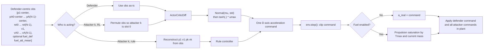

# Policy Inputs And Actuator Outputs

This repo uses the `1v1` / single-attacker path in `core/env.py` + `rl_infer.py`.

The policy output is a bounded acceleration command. The environment then clips it again and, if fuel is enabled, converts it into a realized acceleration subject to thrust and mass limits before propagating the dynamics.

## 1v1 Policy Flow

```mermaid
flowchart LR
    A[World state<br/>p_def v_def p_att v_att<br/>optional KF beliefs<br/>optional fuel state] --> B[Observation builder]
    B --> C["obs = [p_def-center,<br/>p_att_obs-center,<br/>p_att_obs-p_def_obs,<br/>v_def_obs,<br/>v_att_obs,<br/>optional fuel_def fuel_att]"]

    C --> D{Policy implementation}

    D -->|Standard RL| E[ActorCriticDiff]
    E --> E1[Prior layer<br/>DiffLSLayer or NoPriorLayer]
    E1 --> E2[Policy features]
    E2 --> E3[MLP -> residual mean mu_res]
    E1 --> E4[u_prior]
    E3 --> E5["mu = mu_res + blend * u_prior<br/>Normal(mu, exp(logstd))"]
    E5 --> E6{Deterministic?}
    E6 -->|Yes| E7[u_raw = mean]
    E6 -->|No| E8[u_raw sampled from Normal]

    D -->|Student / distilled| F["PartialObsStudentPolicy<br/>inputs: xhat_rel=[rel, v_att-v_def], sigma_feat, u_prev"]
    F --> G

    E7 --> G["a_cmd = tanh(u_raw) * umax"]
    E8 --> G

    G --> H["Policy output<br/>D-axis acceleration command"]
    H --> I["env.step(): clip to [-umax, umax]"]
    I --> J{Fuel enabled?}
    J -->|No| K[a_real = a_cmd]
    J -->|Yes| L["_apply_propulsion()<br/>F_req = m * a_cmd<br/>saturate by Tmax<br/>a_real = F / m"]
    K --> M["Plant update<br/>x_{k+1} = Ad x_k + Bd a_real"]
    L --> M
```



## 1vN Policy Flow



## Required Inputs

### 1v1 observation contract

Defender policy input:

```text
[p_def - center,
 p_att_obs - center,
 p_att_obs - p_def,
 v_def,
 v_att_obs,
 optional fuel_frac_def,
 optional fuel_frac_att]
```

Attacker policy input:

```text
[p_def_obs - center,
 p_att - center,
 p_att - p_def_obs,
 v_def_obs,
 v_att,
 optional fuel_frac_def,
 optional fuel_frac_att]
```

Notes:

- If `use_kf=True`, the `*_obs` terms may be estimator beliefs instead of ground-truth opponent states.
- For student checkpoints, the policy internally reduces the observation to:

```text
xhat_rel = [relative_position, relative_velocity]
sigma_feat = flattened covariance feature
u_prev = previous action
```

### 1vN observation contract

Shared observation before attacker permutation:

```text
[p_def - center,
 p_A0 - center, ..., p_A(N-1) - center,
 p_A0 - p_def, ..., p_A(N-1) - p_def,
 v_def,
 v_A0, ..., v_A(N-1),
 optional fuel_frac_def,
 optional mean_attacker_fuel_frac]
```

Notes:

- The defender sees this observation directly.
- An RL attacker uses the same vector after ego-permutation so "my" state is attacker slot `0`.
- If `use_kf=True`, attacker states in the defender observation may come from the defender-side estimator bank.

## Outputs

Policy output:

```text
a_cmd in R^D
```

Meaning:

- `D=3`: `[ax, ay, az]`
- `D=2`: `[ax, ay]`
- Each component is bounded to `[-umax, +umax]` by the policy squash, then clipped again in `env.step()`.

Actuator/plant-facing output:

```text
a_real in R^D
```

Where:

- If fuel is disabled: `a_real = a_cmd`
- If fuel is enabled: `a_real` is the thrust-limited acceleration after `_apply_propulsion()`

## Code Anchors

- Observation construction: `core/env.py`
- Standard inference wrapper: `rl_infer.py`
- Policy network and squash: `core/models.py`
- Student / distilled policy path: `core/distill.py`
